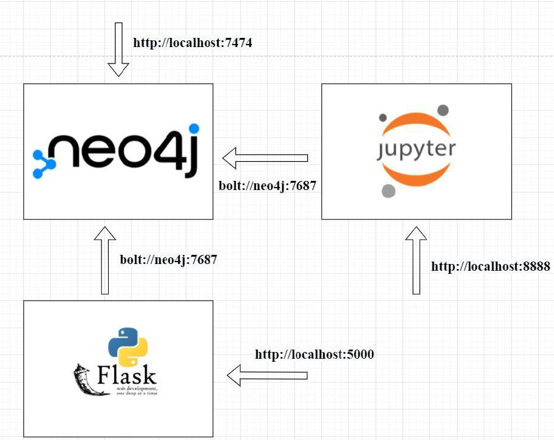
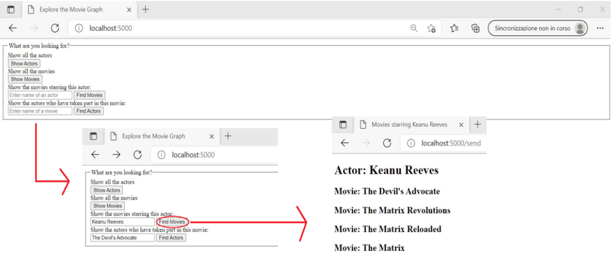

# Implementation-and-containerization-using-Docker-of-a-client-server-application

## Introduction
In this project, a client/server application consisting of an interaction with a graph database was implemented, creating and deploying three containers, each of which contributes to the proper functioning of the application.

## Architecture
The figure below shows the architecture of the application, where the three containers and endpoints for accessing the different components are highlighted:

## Use case
Through the endpoint 'http://localhost:5000' we access the user interface of the application, which is represented by a simple form made with html. The user can perform several actions, each of which gives rise to a request that is handled by the server which in turn interacts, through the Python driver with the Neo4j database. The database responds to the various queries by returning the results to the server, which in turn returns them in the form of an html document to the client. A compact example of form interaction and subsequent return of a result is shown in the figure below:

The aim of the project was not to build a complex application but to show how to use Docker to create multiple contaneirs and make them interact with each other.